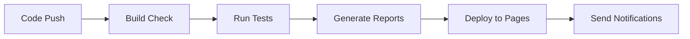

# Sales Portal Test Automation Framework

[](https://playwright.dev/)
[](https://www.typescriptlang.org/)
[](https://nodejs.org/)
[](https://allurereport.org/)

A comprehensive test automation framework for a Sales Portal application, implementing both API and UI testing using Playwright and TypeScript with advanced schema validation and notification systems.

## 📖 Table of Contents

- [Overview](#overview)
- [Features](#features)
- [Recent Updates](#recent-updates)
- [Tech Stack](#tech-stack)
- [Project Structure](#project-structure)
- [Setup](#setup)
- [Configuration](#configuration)
- [Running Tests](#running-tests)
- [Schema Validation](#schema-validation)
- [Reporting & Notifications](#reporting--notifications)
- [Code Quality](#code-quality)
- [CI/CD](#cicd)
- [Contributing](#contributing)

## 🎯 Overview

This project is a production-ready test automation framework designed to test a Sales Portal application. It covers comprehensive testing scenarios for:

- **Products Management** - Create, read, update, delete product operations
- **Customers Management** - Customer lifecycle management  
- **Orders Management** - Order processing and tracking with delivery management
- **Authentication & Authorization** - User login and role-based access
- **Data Validation** - Comprehensive JSON schema validation
- **Notifications** - Automated test result notifications via Telegram

The framework supports both API-level testing for backend validation and UI testing for end-to-end user workflows.

## ✨ Features

- **Dual Testing Approach**: API and UI test coverage
- **Advanced Schema Validation**: Comprehensive JSON schema validation with AJV
- **Modular Schema Architecture**: Reusable schema components for Orders, Delivery, Users
- **Page Object Model**: Structured UI automation with reusable components
- **API Service Layer**: Clean separation of API operations and business logic
- **Test Data Generation**: Smart data generation with validation rules using Faker.js
- **Parallel Execution**: Multi-worker test execution for faster feedback
- **Multiple Test Projects**: Separate configurations for UI, API, and smoke tests
- **Visual Testing**: Screenshot comparison and video recording
- **Test Tagging**: Organized test execution with smoke, regression tags
- **Allure Reporting**: Rich test reports with detailed analytics and environment info
- **Telegram Notifications**: Automated test result notifications
- **Code Quality Tools**: ESLint, Prettier, and Husky pre-commit hooks with lint-staged
- **GitHub Actions CI/CD**: Automated testing and report deployment
- **TypeScript**: Full type safety with comprehensive interfaces and IntelliSense support

## 🆕 Recent Updates

### Schema Validation Enhancements
- **New Schema Modules**: Added dedicated schemas for Orders, Delivery, and Users
- **Modular Design**: Schemas now import and reuse components for better maintainability
- **Type Safety**: Schema definitions now align with TypeScript interfaces
- **Validation Coverage**: Extended validation for complex nested objects

### Advanced Test Infrastructure
- **Smart Data Generation**: Enhanced customer and product data generation with validation rules
- **Notification System**: Telegram integration for automated test result notifications
- **Global Teardown**: Post-test cleanup and notification handling
- **Enhanced Reporting**: Improved Allure reports with environment information

### Code Quality Improvements
- **Modern ESLint Configuration**: Updated to latest ESLint standards with TypeScript support
- **Lint-Staged Integration**: Pre-commit hooks now run targeted linting and formatting
- **GitHub Actions**: Comprehensive CI/CD pipeline with automated report deployment
- **Build Validation**: Separate workflow for TypeScript compilation checks

## 🛠 Tech Stack

| Category | Technology |
|----------|------------|
| **Test Framework** | Playwright 1.57.0 |
| **Language** | TypeScript 5.9.3 |
| **Test Data** | Faker.js, BSON |
| **Schema Validation** | AJV with custom schemas |
| **Reporting** | Allure 3.4.3, Playwright HTML |
| **Notifications** | Telegram Bot API |
| **Code Quality** | ESLint 9.39.1, Prettier 3.7.3 |
| **Package Manager** | npm |
| **CI/CD** | GitHub Actions, Husky 9.1.7 |
| **Utilities** | Lodash, Moment.js |

## 📁 Project Structure

```
src/
├── api/                          # API Testing Layer
│   ├── api/                      # API endpoint implementations
│   │   ├── customers.api.ts      # Customer API operations
│   │   ├── login.api.ts          # Authentication API
│   │   └── products.api.ts       # Product API operations
│   ├── apiClients/              # HTTP clients
│   │   ├── baseApiClient.ts     # Abstract API client
│   │   ├── requestApi.ts        # Playwright request implementation
│   │   └── types.ts             # API client interfaces
│   └── service/                 # Business logic services
│       ├── customer.service.ts   # Customer business operations
│       ├── login.service.ts     # Login business operations
│       └── products.service.ts   # Product business operations
│
├── config/                      # Configuration files
│   ├── apiConfig.ts            # API endpoints configuration
│   ├── env.ts                  # Environment variables
│   └── global.teardown.ts      # Global test teardown with notifications
│
├── data/                       # Test data and schemas
│   ├── salesPortal/           # Domain-specific constants and generators
│   │   ├── constants.ts       # Timeout constants
│   │   ├── country.ts         # Country enumerations
│   │   ├── delivery-status.ts # Delivery status and interfaces
│   │   ├── order-status.ts    # Order status enumerations
│   │   ├── customers/         # Customer data generators
│   │   ├── orders/           # Order data generators with delivery
│   │   └── products/         # Product-related data and test cases
│   ├── schemas/               # JSON schemas for validation
│   │   ├── core.schema.ts    # Common schema patterns
│   │   ├── customers/        # Customer validation schemas
│   │   ├── delivery/         # Delivery information schemas
│   │   ├── login/           # Authentication schemas
│   │   ├── orders/          # Order validation schemas
│   │   ├── products/        # Product validation schemas
│   │   └── users/           # User management schemas
│   └── types/               # TypeScript interfaces
│       ├── core.types.ts    # Common type definitions
│       ├── credentials.types.ts # Authentication types
│       ├── customer.types.ts # Customer interfaces
│       ├── order.types.ts   # Order interfaces with delivery
│       ├── product.types.ts # Product interfaces with test cases
│       └── user.types.ts    # User management types
│
├── fixtures/                  # Test fixtures and utilities
│   ├── api.fixture.ts        # API test fixtures with services
│   ├── business.fixture.ts   # Business logic fixtures
│   ├── pages.fixture.ts      # Page object fixtures
│   └── index.ts             # Fixture aggregator with mergeTests
│
├── tests/                    # Test suites
│   ├── api/                 # API test cases with DDT
│   │   ├── customers/       # Customer API tests with positive/negative scenarios
│   │   ├── orders/         # Order API tests (planned)
│   │   └── products/       # Product API tests with CRUD operations
│   └── ui/                 # UI test cases
│       └── sales-portal/   # Sales portal UI tests
│
├── ui/                      # UI Testing Layer
│   └── pages/              # Page Object Models
│       ├── base.page.ts    # Base page with request/response interceptors
│       ├── base.modal.ts   # Base modal functionality
│       ├── home.page.ts    # Home page with metrics
│       ├── login/          # Login page components
│       └── salesPortal.page.ts # Sales portal base page
│
└── utils/                   # Utility functions
    ├── date.utils.ts       # Date manipulation with Moment.js
    ├── enum.utils.ts       # Enum helper functions
    ├── notifications/      # Notification services
    │   ├── notifications.service.ts # Abstract notification interface
    │   └── telegram.service.ts     # Telegram Bot implementation
    ├── queryParams.utils.ts # URL query parameter utilities
    ├── report/             # Reporting utilities
    │   └── logStep.utils.ts # Test step logging with decorators
    └── validation/         # Validation utilities
        ├── validateResponse.utils.ts # Response validation with schemas
        └── validateSchema.utils.ts   # JSON schema validation
```

## 🚀 Setup

### Prerequisites

- **Node.js** (v16 or higher)
- **npm** (v8 or higher)  
- **Git**
- **Java** (for Allure reports)

### Installation

1. **Clone the repository:**

   ```bash
   git clone https://github.com/DorityTM/AQA_4_PROD_SALES_PORTAL.git
   cd AQA_4_PROD_SALES_PORTAL
   ```

2. **Install dependencies:**

   ```bash
   npm install
   ```

3. **Install Playwright browsers:**

   ```bash
   npx playwright install
   ```

4. **Set up environment variables:**
   ```bash
   cp .env.dist .env
   ```
   Edit `.env` file with your configuration:
   ```env
   USER_NAME=your_username
   USER_PASSWORD=your_password
   SALES_PORTAL_URL=https://your-sales-portal.com
   SALES_PORTAL_API_URL=https://your-api.com
   TELEGRAM_BOT_TOKEN=your_bot_token
   TELEGRAM_CHAT_ID=your_chat_id
   ```

## ⚙️ Configuration

### Environment Variables

| Variable | Description | Required | Example |
|----------|-------------|----------|---------|
| `USER_NAME` | Login username | ✅ | admin@example.com |
| `USER_PASSWORD` | Login password | ✅ | secretPassword |
| `SALES_PORTAL_URL` | Frontend application URL | ✅ | https://sales-portal.com |
| `SALES_PORTAL_API_URL` | Backend API URL | ✅ | https://api.sales-portal.com |
| `TELEGRAM_BOT_TOKEN` | Telegram bot token for notifications | ⚠️ | 123456:ABC-DEF |
| `TELEGRAM_CHAT_ID` | Telegram chat ID for notifications | ⚠️ | -1001234567890 |

### Test Projects Configuration

```typescript
// playwright.config.ts projects:
{
  name: "setup",                    // Authentication setup
  name: "sales-portal-ui",          // UI tests with auth state  
  name: "sales-portal-api",         // API-only tests
  name: "chromium",                 // Headless browser tests
}
```

## 🧪 Running Tests

### Available Commands

```bash
# All Tests
npm test                          # Run all tests
npm run build                     # TypeScript compilation

# UI Tests  
npm run test:ui                   # Run UI tests
npm run test:ui:smoke             # Run UI smoke tests
npm run test:ui:regression        # Run UI regression tests
npm run ui-mode                   # Interactive test mode

# API Tests
npm run test:api                  # Run API tests
npm run test:api:regression       # Run API regression tests

# Reporting
npm run html-report-open          # Open Playwright HTML report
npm run allure-report            # Generate Allure report
npm run allure-report-open       # Generate and open Allure report
```

### Test Execution Examples

```bash
# Run specific test types
npx playwright test --project=sales-portal-api
npx playwright test --project=sales-portal-ui --grep "@smoke"

# Run specific test files
npx playwright test src/tests/api/customers/
npx playwright test src/tests/api/products/create.spec.ts

# Run with specific tags
npx playwright test --grep "@regression"
npx playwright test --grep "@smoke|@api"
```

### Test Tags System

| Tag | Description | Usage |
|-----|-------------|-------|
| `@smoke` | Critical functionality tests | Quick validation |
| `@regression` | Full regression test suite | Complete validation |
| `@api` | API-specific tests | Backend testing |
| `@ui` | UI-specific tests | Frontend testing |
| `@integration` | Integration tests | End-to-end flows |
| `@customers` | Customer management tests | Customer domain |
| `@products` | Product management tests | Product domain |
| `@orders` | Order management tests | Order domain |

## 🔍 Schema Validation

### Comprehensive Validation Framework

The project implements a robust JSON schema validation system:

```typescript
// Example: Product validation
import { createProductSchema } from "data/schemas/products/create.schema";
import { validateResponse } from "utils/validation/validateResponse.utils";

validateResponse(response, {
  status: STATUS_CODES.CREATED,
  schema: createProductSchema,
  IsSuccess: true,
  ErrorMessage: null,
});
```

### Schema Architecture

- **Modular Design**: Reusable schema components
- **Type Alignment**: Schemas match TypeScript interfaces  
- **Validation Coverage**: Orders, Products, Customers, Users, Delivery
- **Error Reporting**: Detailed validation error messages

## 📊 Reporting & Notifications

### Allure Reporting

Advanced reporting with:
- **Environment Information**: Test environment details
- **Step-by-Step Execution**: Detailed test steps with attachments
- **Performance Metrics**: Test execution timing
- **Historical Trends**: Test stability analysis
- **Request/Response Logging**: Complete API interaction logs

### Telegram Notifications  

Automated notifications include:
- **Test Completion Status**: Pass/fail summary
- **Report Links**: Direct links to deployed reports
- **CI/CD Integration**: Automatic notifications from GitHub Actions

```typescript
// Notification service usage
const notificationService = new NotificationService(new TelegramService());
await notificationService.postNotification("Test run completed!");
```

## 🔧 Code Quality

### Modern Tooling Setup

```bash
# Code Quality Commands
npm run format                    # Check code style
npm run format:fix               # Fix code style issues  
npm run lint                     # Run ESLint
npm run lint:fix                 # Fix ESLint issues
npm run prettier                 # Check Prettier formatting
npm run prettier:fix             # Fix Prettier formatting
```

### Pre-commit Quality Gates

**Husky + Lint-Staged Configuration:**
- ✅ **TypeScript compilation** check
- ✅ **ESLint** validation with auto-fix
- ✅ **Prettier** formatting
- ✅ **Targeted linting** for changed files only

```json
{
  "lint-staged": {
    "src/**/*.{ts,tsx,js,jsx}": ["eslint --fix"],
    "src/**/*.{ts,tsx,js,jsx,json,md,yml,yaml,css,scss}": ["prettier --write"]
  }
}
```

## 🚀 CI/CD

### GitHub Actions Workflows

**1. Test Execution Workflow (`.github/workflows/tests.yml`):**
```yaml
- API regression tests
- Allure report generation  
- GitHub Pages deployment
- Telegram notifications
- Java + Playwright environment setup
```

**2. Build Validation Workflow (`.github/workflows/build.yml`):**
```yaml
- TypeScript compilation check
- Pull request validation
- Node.js 22 environment
```

### Features

- **Automated Testing**: Triggers on push/PR to main
- **Report Deployment**: Auto-deploy to GitHub Pages  
- **Environment Secrets**: Secure credential management
- **Notification Integration**: Telegram alerts on completion
- **Manual Triggers**: `workflow_dispatch` support

### CI/CD Pipeline Flow



## 🎨 Advanced Development Patterns

### Data-Driven Testing (DDT)

```typescript
// Example: Customer creation test cases
export const CREATE_CUSTOMER_POSITIVE_CASES: ICreateCustomerCases[] = [
  {
    title: "Verifying email input: upper-case",
    customerData: generateCustomerData({ email: "TEST@EXAMPLE.COM" }),
  },
  // ... more test cases
];

for (const tc of CREATE_CUSTOMER_POSITIVE_CASES) {
  test(tc.title, async ({ customersApi }) => {
    const response = await customersApi.create(token, tc.customerData);
    // validation logic
  });
}
```

### Smart Data Generation

```typescript
// Enhanced data generation with validation rules
export function generateCustomerData(params?: Partial<ICustomer>): ICustomer {
  const data: ICustomer = {
    email: validEmail(),                    // Ensures valid email format
    name: onlyLetters(nameRaw, 40),        // Strips invalid characters
    phone: validPhone(),                   // Generates valid phone format
    // ... other validated fields
  };
  return { ...data, ...params };
}
```

### Service Layer Pattern

```typescript
// Business logic abstraction
export class CustomersApiService {
  async create(token: string, customerData?: ICustomer) {
    const data = generateCustomerData(customerData);
    const response = await this.customerApi.create(token, data);
    validateResponse(response, { 
      status: STATUS_CODES.CREATED,
      IsSuccess: true 
    });
    return response.body.Customer;
  }
}
```

## 🤝 Contributing

### Development Workflow

1. **Create feature branch:**
   ```bash
   git checkout -b feature/new-functionality
   ```

2. **Implement changes** following established patterns

3. **Quality checks** (automated via pre-commit):
   ```bash
   npm run format:fix
   npm run build
   npm test
   ```

4. **Commit with conventional format:**
   ```bash
   git commit -m "feat: add order management API tests"
   ```

5. **Create Pull Request** with detailed description

### Code Standards

- **TypeScript**: Strict mode with comprehensive type definitions
- **ESLint**: Modern configuration with TypeScript support  
- **Prettier**: Consistent formatting (120 char width, no single quotes)
- **Test Structure**: Clear describe blocks with proper tagging
- **Documentation**: JSDoc comments for complex functions
- **Error Handling**: Comprehensive error messages and validation

## 📝 License

This project is licensed under the ISC License.

## 👥 Authors

**Tatsiana Davidziuk** - [GitHub Profile](https://github.com/DorityTM)

**Contributors:**
- **Aliaksei Harashchuk** - [GitHub Profile](https://github.com/aharashchuk)
- **Diana Shurukhina** - [GitHub Profile](https://github.com/DiShurukhina)
- **Palina Razumeika** - [GitHub Profile](https://github.com/rapolinka)
- **Oleg Sushko** - [GitHub Profile](https://github.com/os8580)
- **Nail Apkaev** - [GitHub Profile](https://github.com/NailApkaev)

---

## 🆘 Troubleshooting

### Common Issues

**Environment Setup:**
- Verify all environment variables in `.env`
- Check network connectivity to test environments  
- Ensure browser installation: `npx playwright install`
- Java installation for Allure: Required for report generation

**Test Execution:**
- Clear artifacts: `rm -rf test-results/ playwright-report/ allure-results/`
- Update dependencies: `npm update`
- Check TypeScript compilation: `npm run build`

**CI/CD Issues:**
- Verify GitHub secrets are configured
- Check workflow permissions for Pages deployment
- Ensure Telegram bot token is valid for notifications

**Schema Validation:**
- Validate schema syntax with AJV documentation
- Check type alignment between schemas and TypeScript interfaces
- Review validation error messages in test output

For additional support, please check the [Issues](https://github.com/DorityTM/AQA_4_PROD_SALES_PORTAL/issues) page.
